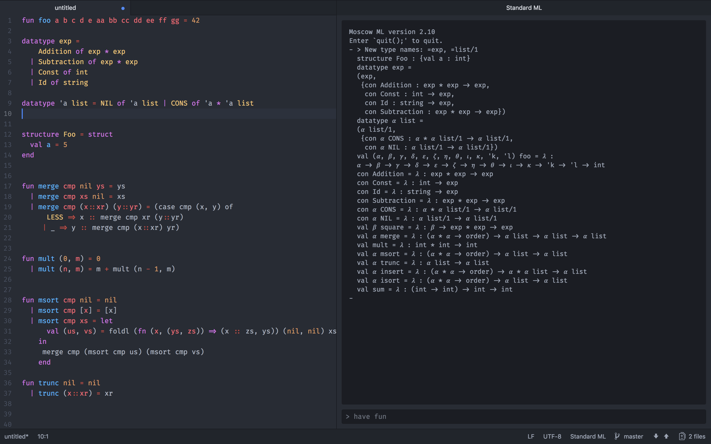

# SML Language Support for Atom

## This package provides language support for SML
 * Syntax Highlighting
 * REPL Execution in MoscowML
 * Primitive Autocompletion
 * SML Snippets
  

Grammars are generated with the awesome typescript grammar of [@freebroccolo](https://github.com/freebroccolo)
